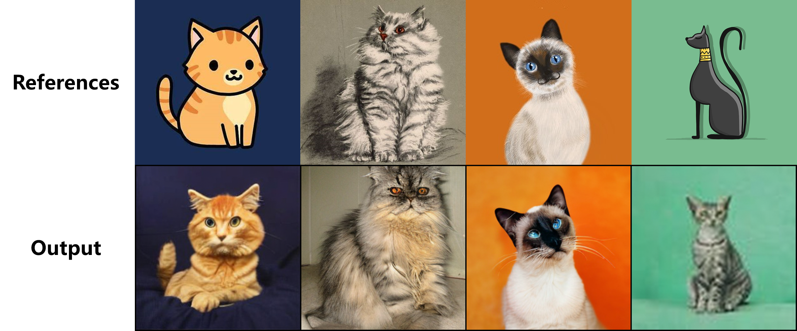

# Graduation Project

> This repository is heavily based on [facebookresearch/DiT](https://github.com/facebookresearch/DiT) and [jychoi118/ilvr_adm](https://github.com/jychoi118/ilvr_adm). [assafshocher/PyTorch-Resizer](https://github.com/assafshocher/PyTorch-Resizer) is used for resizing the latent variable of reference images.

该仓库为我的本科毕业设计项目。

我ILVR的方法加入到了DiT模型中，并使用DiT的预训练模型`DiT-XL-2-256x256.pt`进行采样。

## cat2dog

```bash
cls=($(seq 154 157))
cls+=(208 249 258)
len_cls=${#cls[*]}

echo $len_cls

now_idx=0

while [ $now_idx -lt $len_cls ]; do
    python sample.py --image-size 256 --seed 2 --base_samples 'refs/cat' --down_N 4 --range_t 80 --cls_labels $((${cls[$now_idx]})) $((${cls[$now_idx]})) $((${cls[$now_idx]})) $((${cls[$now_idx]}))
    mv output/N4_t80.png output/N4_t80_$((${cls[$now_idx]})).png
    now_idx=$(($now_idx+1))
done
```

results:


## animation2reality

```bash
python sample.py --image-size 256 --seed 1 --base_samples 'refs/animation' --down_N 2 --range_t 95 --cls_labels 281 283 284 285
```

results:

